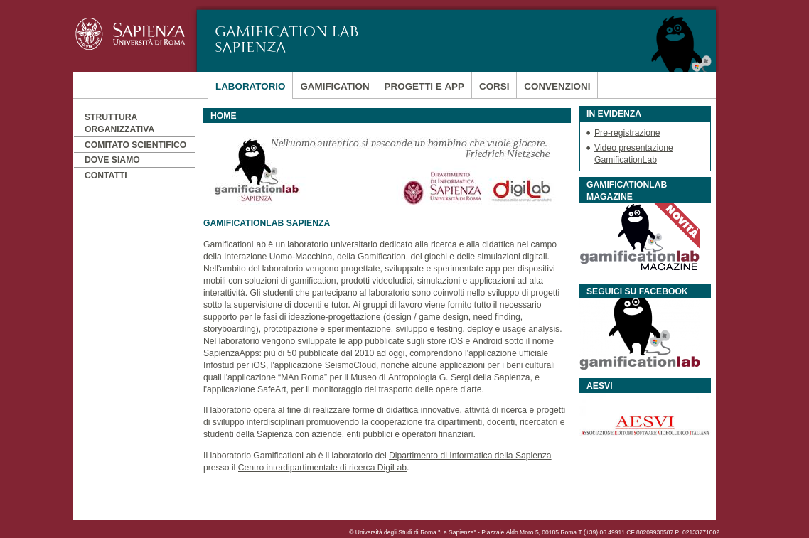

# Hugo theme for Sapienza website (old style)

This theme is a porting of the old template for Sapienza University websites.

All "folders" below the header are taken from the first level of `main` menu. All subtrees are drawn in the left menu in the corresponding "folder".

In the front-matter you can add a `pagemenu` key with an array of items to be drawn in the left part of the page.

# License

See `LICENSE` file for template files.

**Please note that this repository contains some images which are subjected to copyright from Sapienza University**: for those (Sapienza logo, font, etc) please see the corresponding regulation at https://www.uniroma1.it/en/pagina/brand-template-and-visual-identity